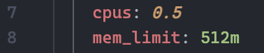
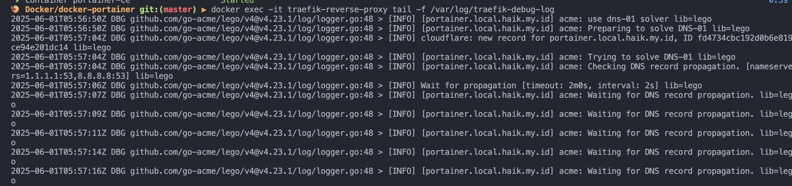
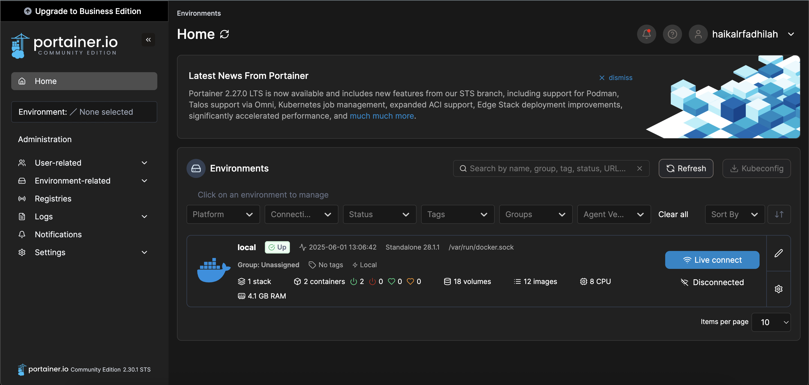
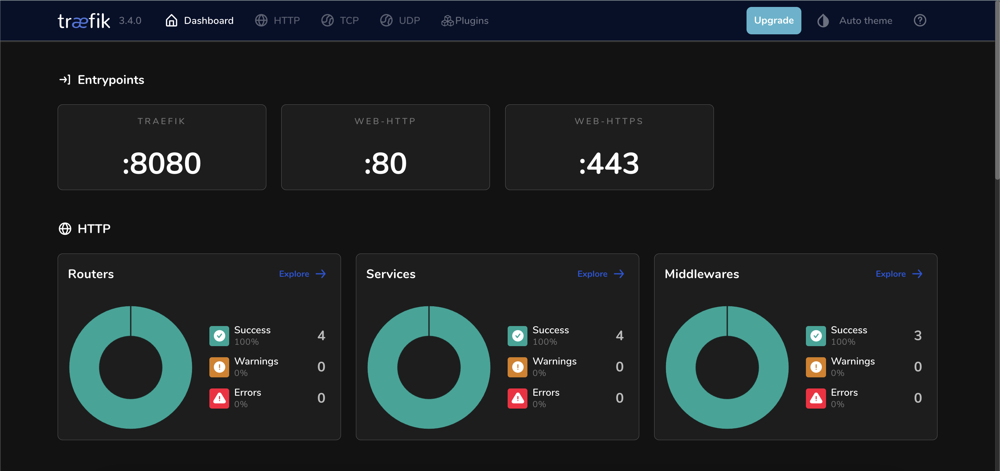

# Portainer Deployment with Docker Compose and Traefik Reverse Proxy

Let's get acquainted with this project, what is this project exactly? In this project I made a simple docker compose script to do a Portainer deployment for Docker Engine management and Docker Resource Monitoring. To facilitate domain installation and TLS installation I also use Traefik Reverse Proxy so that you can use your Domain directly to access the Portainer.

What is Portainer? so that you are not confused, simply put, Portainer is a UI management application for Docker where you can create, manage Docker resources with a GUI such as Containers, Images, Volumes, Network and so on.

After understanding let's move on to the general requirements to be able to run this project.

## Project Requirements

To be able to run this project, there are actually easy requirements that you must fulfill. Here's a list of requirements for running this project:

- Docker Engine (Absolutely mandatory and make sure you have it on your server 🐳)

- Docker Compose (Usually already exists when you have a docker engine. But you should check it again with the `docker compose --help` command)

- Public Domain (In this case the portainer is installed on a server, I hope you have a public domain)

- Cloudflare account (To generate TLS with ACME I use Cloudflare, and make sure your Public Domain is connected to Cloudflare)

Have you met the above requirements? Let's move on to the next steps

> [!INFO]
> You can also customize the Resource Container to your liking according to the guide below. You can also change the others according to your needs.

You can open the `docker-compose.yml` file and on lines 7 and 8 and lines 28 and 29 you can see the resource container configuration related to cpu usage and memory limits.



You can change when you need more resources in both containers or less resources for laptops with limited specifications.

## Deployments Steps

Let's get into this very easy and fast deployment stage HAHA. You can see the guide and brief description of the deployment steps below :

1. Clone Repository Project

```bash
git clone https://github.com/HaikalRFadhilahh/portainer-docker-with-traefik-rp.git portainer-docker
```

2. Change Folder to Project Directory

```bash
cd portainer-docker
```

3. Export Operating System Variable

   To simplify dynamic configuration in docker compose I use OS Variable so you are required to configure it first:
   **a. Unix Operating Systems Based (Linux / Mac Os)**

   ```bash
   export CF_EMAIL=your_cloudflare_email
   export CF_DNS_API_TOKEN=your_cloudflare_dns_api_token
   export TRAEFIK_HOST=127.0.0.1
   export TRAEFIK_HTTP_PORT=80
   export TRAEFIK_HTTPS_PORT=443
   export TRAEFIK_DASHBOARD_PORT=8080
   export PORTAINER_DOMAIN=your_publid_domain_for_portainer
   ```

   **b. Windows Desktop / Windows Server**

   ```bash
   set CF_EMAIL=your_cloudflare_email
   set CF_DNS_API_TOKEN=your_cloudflare_dns_api_token
   set TRAEFIK_HOST=127.0.0.1
   set TRAEFIK_HTTP_PORT=80
   set TRAEFIK_HTTPS_PORT=443
   set TRAEFIK_DASHBOARD_PORT=8080
   set PORTAINER_DOMAIN=your_publid_domain_for_portainer
   ```

   Make sure you have adjusted the data above and create and point the domain to your server ip and generate the Cloudflare DNS API Token, if you need a guide, you can see [here](https://developers.cloudflare.com/fundamentals/api/get-started/create-token/).

4. Pull Image Traefik Reverse Proxy and Portainer Comunity Edition

```bash
docker compose pull
```

Actually you can directly run the command `docker compose up -d` it will run the project and pull the image. But I separated it to clarify each function.

5. Running Docker Compose Portainer and Traefik

```bash
docker compose up -d
```

Hooray. Your project should be accessible through the domain that you have configured. And you can see the traefik dashboard through your Server Ip with port 8080.

> [!INFO]
> You can monitor the debug logs of traefik

When you want to monitor debug logs of reverse proxy traffic access you can use the `docker exec` feature which can be utilized to display logs. You can execute the command below:

```bash
docker exec -it traefik-reverse-proxy tail -f /var/log/traefik-debug-log
```

You should get the output below. You can exit with `ctrl + c`.



> [!WARNING]
> Please be careful that turning off docker compose with `docker compose down -v` may erase the portainer data.

You can turn off all docker compose services including portainer comunity edition and traefik reverse proxy with the command below:

If you want to shut down the service and delete the container data.

```bash
docker compose down -v
```

or

If you want to shut down the service without deleting the tls traefik volume and auth data portainer.

```bash
docker compose down
```

## Project Results

Here are the screenshots of the Traefik API Dashboard and Portainer that have been deployed on your Linux Server, Linux Desktop or Personal Device.

1. Portainer Comunity Edition



2. Traefik API Dashboard



Congratulations you have successfully deployed Traefik and Portainer. If you experience problems you can create an Issue in this Repository or Read the Reference Documentation below.

## References

- Official Traefik Reverse Proxy Documentation which you can see [here](https://doc.traefik.io/traefik/).
- Official Documentation of Portainer Comunity Edition that you can check and learn from the following [link](https://docs.portainer.io/).
- The Official Reverse Proxy Portainer Comunity Edition Guide which you can check for yourself at the following [link](https://docs.portainer.io/advanced/reverse-proxy)

## Contributing

You can contribute to this project through Pull Requests to this Repository, or you can report bugs or vulnerabilities through the issues feature on github. 🐳

## License

Free for personal and commercial use. You may modify and distribute it without restriction.

<hr>

<p align="center">Created By Haikal and Contributors with ❤️</p>
